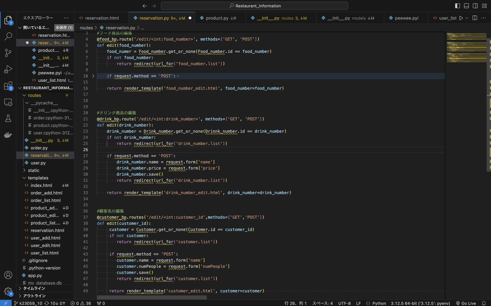

# k23059_10
第10回課題
1.データ登録アプリケーションにて登録するデータ
・飲食店の顧客やメニュー、入っている予約などのデータを登録する。
    ・フードリスト
    ーフードの商品名
    ーその値段

    ・ドリンクリスト
    ードリンクの商品名
    ーその値段

    ・顧客リスト
    ー顧客代表者の名前
    ー予約人数

    ・予約リスト
    ー顧客の名前
    ーフード商品名
    ードリンク商品名
    ー予約の合計金額

2.自分が担当したデータや画面
・予約リストの編集画面と編集するプログラムを作成した。編集画面はproduct_edit.htmlの内容を変更した。編集プログラムはproduct.pyを参考にし、
　メンバーが変更した変数名に合わせるようプログラムした。

3.自分が作成した画面のスクリーンショット

4.感想
・アイディアを出し役割分担を行うところまでは良かったが、解散した後の連絡の伝達がうまくいかず提出がギリギリになってしまった。リーダーは積極的にアイディアを出してくれたり、サポートをしてくれたため自分を含め、グループ全体がお互いにこういった行動を取れるようにすべきだと思った。